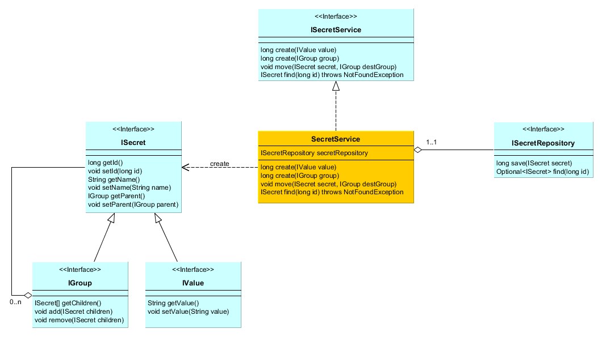

Keystore aims to provide an web interface in order to manage passwords and secret keys.<br>

## User and roles

A user should be able to log in the application.<br>
He is also able to change his own information.<br>
He should be able to ask for resetting his password.<br>
He is created by an admin who gives him several roles (see after).<br>

A same user can be reader for a given perimeter and contributor for another.<br>
When a user wants to be "reader" or "manager" for a given perimeter, he has to ask the manager for being granted.<br>

### Reader

The reader role means the user is authorized to view and copy some secret keys.<br>
However, he is not authorized to update the secret.<br>

### Manager

A manager is responsible of a secret perimeter.<br>
He is able to create any secret or sub-perimeter for a given perimeter he manages.<br>
He has obviously the Reader role for its own perimeter.<br>

A manager is able to grant any user for any group he manages.<br>
He is able to grant read roles but also manager roles to other users.<br>
He is notified when a user asks for a roles within a perimeter he manages.<br>
He is free to accept or refuse.<br>

### Admin

An admin is responsible of creating and removing users.<br>
An admin is manager for all groups and inherit their rights.<br>

## Secret perimeter

Defining a secret consists in setting a password or a secret value to an object and to attach this object to a group.<br>
Groups and secret objects can be built as a tree.<br>
Each group node can be granted for being read or managed.<br>

````
root
|
|- group_1
    |- secret_1_0

    |- group_1_2
        |- secret_1_2_0
        |- secret_1_2_1
        |- group_1_2_3
            |- secret_1_2_3_0

    |- group_2_2
        |- secret_2_2_0
        |- secret_2_2_1
````

## Class Diagram



## User stories

```
Feature: secret feature

  Background: Root is created
    Given I have created the group 'Root'

  Scenario: I should be able to create a secret value
    Given I have declared the secret 'GMail' with value '@sol1dd;58b'
    When I create the secret 'GMail'
    Then the secret 'GMail' is created
    And the secret 'GMail' is child of 'Root'

  Scenario: I should be able to create a secret group
    Given I have declared the group 'Credentials'
    When I create the secret 'Credentials'
    Then the secret 'Credentials' is created
    And the secret 'Credentials' is child of 'Root'

  Scenario: I should be able to create a secret value under a dedicated group
    Given I have created the group 'Credentials'
    And I have declared, under 'Credentials', the secret 'GMail' with value '@sol1dd;58b'
    When I create the secret 'GMail'
    Then the secret 'GMail' is created
    And the secret 'GMail' is child of 'Credentials'

  Scenario: I should be able to create a secret group under a dedicated group
    Given I have created the group 'Credentials'
    And I have declared, under 'Credentials', the group 'GMail'
    When I create the secret 'GMail'
    Then the secret 'GMail' is created
    And the group 'Credentials' should contain 'GMail'

  Scenario: I should be able to move a secret value from a group to another
    Given I have created the group 'Credentials'
    And I have created the secret 'GMail' with value '@sol1dd;58b'
    When I move the secret 'GMail' to group 'Credentials'
    Then the group 'Credentials' should contain 'GMail'
    But the group 'Root' should not contain 'GMail'

  Scenario: I should be able to move a secret group from a group to another
    Given I have created the secret 'GMail' with value '@sol1dd;58b'
    When I remove the secret 'GMail'
    Then the secret 'GMail' is removed
    And the group 'Root' should not contain 'GMail'

  Scenario: I should be able to remove a secret value
    Given I have created the group 'Credentials'
    When I remove the secret 'Credentials'
    Then the secret 'Credentials' is removed
    And the group 'Root' should not contain 'Credentials'

  Scenario: I should be able to remove a secret group
    Given I have created the group 'Credentials'
    When I remove the secret 'Credentials'
    Then the secret 'Credentials' is removed
    And the group 'Root' should not contain 'Credentials'
 ```
